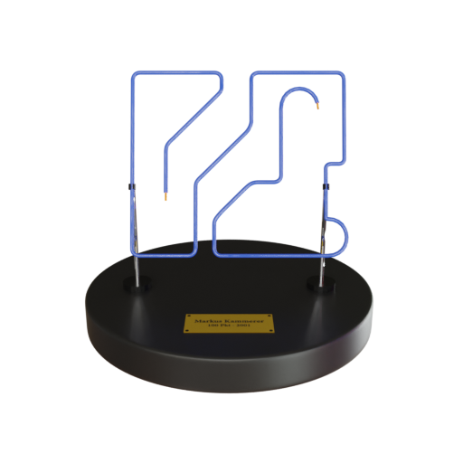

import Section from '../../../components/Section.astro';
import H2 from '../../../components/markdown/h2.astro';
import {Icon} from "astro-icon/components";

import recording from '../../../assets/projects/explore-htl/explorehtl-recording.webm';
import leaderboard from '../../../assets/projects/explore-htl/leaderboard.svg';
import phone from '../../../assets/projects/explore-htl/phone.svg';
import arcore from '../../../assets/icons/ar_core.svg';
import svelte from '../../../assets/icons/svelte.svg';
import unity from '../../../assets/icons/unity.svg';

import {Image} from 'astro:assets';

export const components = {
  h2: H2
}

<Section class="text-body-lg" markdown={{list: true}} name="Description">
  ## Description

  **ExploreHTL** is an **Augmented Reality** experience for your Smartphone.
  You can **explore** the [IT-HTL Ybbs](https://www.sz-ybbs.ac.at) and learn about its room.
  For this project I worked together with <a target='_blank' href='https://hannes-scheibelauer.at'>Hannes Scheibelauer</a>.
</Section>

<Section class="text-body-lg mt-8" name="Architecture">
## Architecture

  

    

      
Printed Page

      

        

        

        

      

      <Icon name="heroicons:qr-code-solid" class="text-9xl text-[#00aaca]" />
    

    

      <Image class="w-48" src={phone} alt="Phone illustration" />

      

        <Image alt="Google ARCore" class="w-24" src={arcore} />
        <Image alt="Unity Game Engine" class="bg-white p-4 rounded-xl w-24 aspect-square" src={unity} />
      

    

    
    

      

      Firebase
    

    

      
    

  

  

    

      

        

          <Icon name="heroicons:user-solid" class='text-3xl' style={{color: '#00aaca'}} />
          <h3 class='text-body-lg'>Registration</h3>
        

        
Choose a nickname by which you will be reffered to on the leaderboard

      

      

        

          <Icon name="heroicons:camera-20-solid" class='text-3xl' style={{color: '#02bbc1'}} />
          <h3 class='text-body-lg'>Scan a QR-Code</h3>
        

        
Look for a page with a QR-Code on it and let the app do its magic

      

      

        

          <Icon name="heroicons:queue-list-16-solid" class='text-3xl' style={{color: '#04c7ba'}} />
          <h3 class='text-body-lg'>Overview</h3>
        

        
Take a look at what items you have already found aswell as infos on your ranking.

      

      

        

          <Icon name="heroicons:gift-top-20-solid" class='text-3xl' style={{color: '#07dcaf'}} />
          <h3 class='text-body-lg'>Rewards</h3>
        

        
When we presented this at our schools open house, you would get a reward for showing us that you completed the game.

      

      

    

    

    <video autoplay loop muted playsinline class='sm:sticky shadow top-[5.5rem] slide-in-view left-2/3 w-80 sm:w-72 mx-auto sm:m-0 rounded-2xl'>
      <source src={recording} type='video/webm' />
      Video dont work
    </video>
  

</Section>

<Section name='3D-Models' class='mt-48 sm:mt-56 sm:m-0' markdown={{}}>
  

    

      <Icon name="heroicons:cube-transparent-solid" class="text-[#00aaca]" />
      <h3 class="text-white-90">3D Models</h3>
    

    
All models used in ExploreHTL were created by hand in blender. The follwing are a few examples.

  

  

    

    

    

  

</Section>

<Section class="mt-8" name='Leaderboard' markdown={{}}>
  

    

      <Icon name="heroicons:trophy" class="text-[#00aaca]" />
      <h3 class="text-white-90">Leaderboard</h3>
    

    
In addition to the app itself, we also create a  leaderboard as a web-app with
    <a href="https://svelte.dev/" target='_blank'>Svelte <Image alt="Svelte Logo" class="inline w-fit mb-3 h-8" src={svelte} /></a>.

  

</Section>

<Section class="sm:text-body-lg text-xl mt-12" markdown={{}} name="Try it out">
## Try it out

  Grab youreslf a build for android from <a href="https://bit.ly/explore-HTL" target="_blank">Google Drive</a> along with the tracking markers.
  Install the app and try scanning the markers with your phone.
</Section>