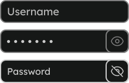

import Section from '../../../components/Section.astro';
import H2 from '../../../components/markdown/h2.astro';
import ColorView from '../../../components/ColorView.astro';
import {Icon} from "astro-icon/components";
import {Image} from 'astro:assets';

import usersMobile from '../../../assets/projects/quetzal-vpn/users-mobile.png';
import usersDesktop from '../../../assets/projects/quetzal-vpn/users-desktop.png';
import configMobile from '../../../assets/projects/quetzal-vpn/config-mobile.png';
import configDesktop from '../../../assets/projects/quetzal-vpn/config-desktop.png';

export const components = {
  h2: H2,
}

<Section class="text-body-lg" markdown={{list: true}} name="Description">
  ## Description

  **QuetalVPN** is a free and open source **Web GUI** for your **OpenVPN** server. **Featuers** include:

  - User Management **👤**  
  - Server Configuration **⚙️**
  - A dashboard **📊**

  For a closer look, check out the <a href="https://quetzal-vpn.dev" target='_blank'>project website</a>.
</Section>

<Section class='text-body-lg text-white-90 mt-12 relative pb-8 text-center' name="Design">

  ## Design

  

    

    

  

  <ColorView class='sm:my-12 my-8' colors={[
    {name: 'Primary', hex: '#00ff70'}, {name: 'Warning', hex: '#f8d40d'}, {name: 'Error', hex: '#ff3633'},
  ]}/>

  
 
    <Image alt="QuetzalVPN Screenshot" class="hidden w-full md:w-auto sm:block" src={configDesktop}/>
    <Image alt="QuetzalVPN Mobile Screenshot" class="sm:hidden" src={configMobile}/>
  

</Section>

<Section class='mt-12' name='Components'>
  <h4 class="text-center text-body-lg">Buttons</h4>
  

    
 

    
 

    
 

    
 

  

  <h4 class="text-center text-body-lg sm:mt-8">Inputs</h4>
  

    
 

    
 

    
 

    
 

    
 

  

  

    
These fully accesable components were created with

    

      
    

    

      

        
      

      

        
      

    

  

</Section>

<Section class='mt-12' name='User Management'>

  ## User Management

  

    

      

        

          <Icon name="heroicons:document-arrow-down-20-solid" class='text-3xl' style={{color: '#00ff70'}} />
          <h3 class='text-body-lg'>Profile Download</h3>
        

        
Gone are the days of using shell scripts to generate profile files for OpenVPN. One click and your download starts!

      
        

        
        

      

    

    

      

        

          <Icon name="heroicons:user-solid" class='text-3xl' style={{color: '#00ff70'}} />
          <h3 class='text-body-lg'>User Actions</h3>
        

        
Temporarily disable or delete a users access to connect to your VPN.

      
        

        
        

        

        
        

      

    

    

    
    

  

  

    <Icon name="heroicons:user-group-solid" class="-z-10 text-white/5 absolute left-1/2 -translate-x-1/2 top-12 text-9xl scale-[3]" />

    

      

        <Icon name="heroicons:chart-bar-square-16-solid" class="text-[#00ff70]" />
        <h3>Live Insights</h3>
      

      
Watch live data on all users regarding their connections status and even IP address

    

    

      <Image src={usersDesktop} alt="Quetzal Users" class="hidden sm:block" />
      <Image src={usersMobile} alt="Quetzal Users" class="sm:hidden" />
    

    

      

 Connected

      

 Idle

      

 Disabled

    

  

</Section>

<Section class="text-body-lg mt-12" markdown={{list: true}} name="More Details">
  ## More Details

  I developed **QuetzalVPN** in a team of 4 as a school project at <a href="https://www.sz-ybbs.ac.at" target="_blank">IT-HTL Ybbs</a>.
  My main focus was the **frontend** and **UI / UX** design.

  The project is open source and available on <a href="https://github.com/QuetzalVPN/quetzal-vpn" target="_blank">GitHub</a>.
  
  <a href="https://github.com/RaZoD1" target="_blank">Raphael</a> was my main **collaborator**. He wrote the backend in **Kotlin**
  using the **Ktor** framework while also being reponsible for server configuration and communication.

  I did my design in **Figma** and implemented it with **React** and **TailwindCSS** for the styling.
</Section>
